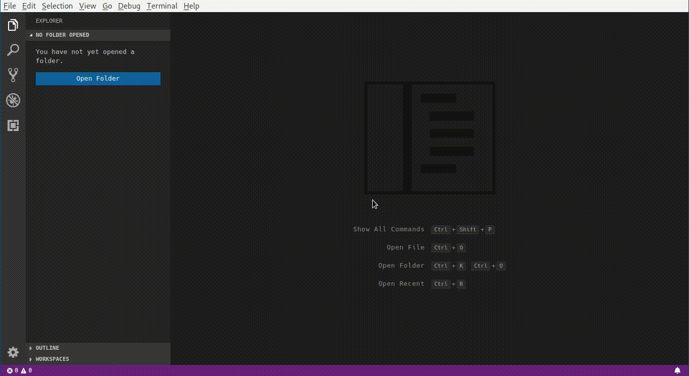

=============================
Features for Odoo development
=============================

**Table of contents**

.. contents::
   :local:

Features
========

Workspace selector
------------------

Workspace selector for Visual Studio Code. Usefull in case of multiproject
work. You can move between projects with minimal efforts via command palette.
Set path to folders with workspace files in the settings (odoo-code.workspace-paths_).
On the command palette, exists a new menuitem *Change workspace*.
It suggests you to choose a workspace and open it in current window.

Break into container
--------------------

Do the same thing as `Docker Containers: Attach Shell` ... but shell will be opened for **root** user.

Open terminal in base folder
----------------------------

Open a new terminal with name **Base** into odoo-code.base-path_ folder.

Snippets
========

* python files:
    + `utf8`: put `# -*- coding: utf-8 -*-`
    + `omanifest`: base `__manifest.py__` template
    + `omodel`: for extension **odoo.models.Model**
    + `ofield`: for creating **odoo.fields**
* xml files:
    + `oxml`: xml declaration and odoo tag
    + `oxpath`: xpath tag
    + `oview`: base template of record tag
    + `otemplate`: base template of template tag
    + `ofield`: field tag (with *name* attribute)
    + `oattribute`: attribute tag (used in xpath when position is *attributes*)

Extension Settings
==================

This extension contributes the following settings:

.. _odoo-code.workspace-paths:

* `odoo-code.workspace-paths`: path to folders which contains workspace files

.. _odoo-code.base-path:

* `odoo-code.base-path`: path to a folder which will be opened in terminal by command `terminal in base folder`
